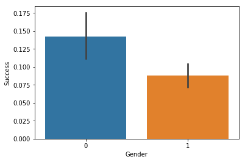
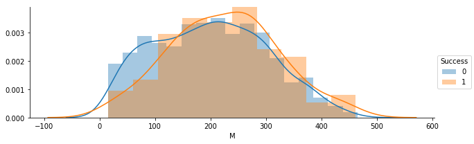
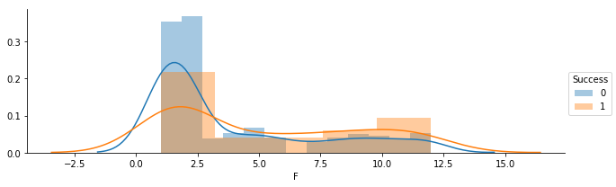
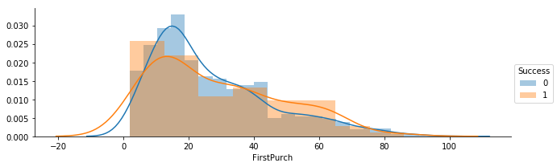
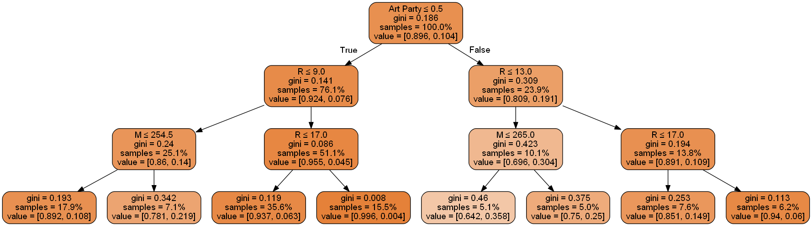

```python
import pandas as pd
import numpy as np
import seaborn as sns
import matplotlib.pyplot as plt
from sklearn.model_selection import train_test_split

%matplotlib notebook
```


```python
orig_df = pd.read_excel('SmartPartyWare.xlsx')
```


```python
orig_df.head()
```


<div>
<style scoped>
    .dataframe tbody tr th:only-of-type {
        vertical-align: middle;
    }

    .dataframe tbody tr th {
        vertical-align: top;
    }

    .dataframe thead th {
        text-align: right;
    }
</style>
<table border="1" class="dataframe">
  <thead>
    <tr style="text-align: right;">
      <th></th>
      <th>Seq#</th>
      <th>ID#</th>
      <th>Gender</th>
      <th>M</th>
      <th>R</th>
      <th>F</th>
      <th>FirstPurch</th>
      <th>Sports Party</th>
      <th>Pool Party</th>
      <th>Barbeque Party</th>
      <th>...</th>
      <th>Random</th>
      <th>Prob(Success==0)</th>
      <th>Prob(Success==1)</th>
      <th>Most Likely Success</th>
      <th>selectBuy</th>
      <th>IndoorParty</th>
      <th>factor1</th>
      <th>Prob(Success==0) 2</th>
      <th>Prob(Success==1) 2</th>
      <th>Most Likely Success 2</th>
    </tr>
  </thead>
  <tbody>
    <tr>
      <th>0</th>
      <td>1119</td>
      <td>27240</td>
      <td>1</td>
      <td>260</td>
      <td>16</td>
      <td>2</td>
      <td>18</td>
      <td>0</td>
      <td>0</td>
      <td>1</td>
      <td>...</td>
      <td>0.001670</td>
      <td>0.955683</td>
      <td>0.044317</td>
      <td>0</td>
      <td>0</td>
      <td>0</td>
      <td>32.500000</td>
      <td>0.998731</td>
      <td>0.001269</td>
      <td>0</td>
    </tr>
    <tr>
      <th>1</th>
      <td>1475</td>
      <td>36588</td>
      <td>0</td>
      <td>259</td>
      <td>12</td>
      <td>5</td>
      <td>30</td>
      <td>1</td>
      <td>0</td>
      <td>1</td>
      <td>...</td>
      <td>0.002305</td>
      <td>0.714476</td>
      <td>0.285524</td>
      <td>0</td>
      <td>0</td>
      <td>2</td>
      <td>107.916667</td>
      <td>0.998731</td>
      <td>0.001269</td>
      <td>0</td>
    </tr>
    <tr>
      <th>2</th>
      <td>345</td>
      <td>8322</td>
      <td>1</td>
      <td>218</td>
      <td>16</td>
      <td>6</td>
      <td>42</td>
      <td>1</td>
      <td>1</td>
      <td>3</td>
      <td>...</td>
      <td>0.004329</td>
      <td>0.955683</td>
      <td>0.044317</td>
      <td>0</td>
      <td>0</td>
      <td>0</td>
      <td>81.750000</td>
      <td>0.998731</td>
      <td>0.001269</td>
      <td>0</td>
    </tr>
    <tr>
      <th>3</th>
      <td>228</td>
      <td>5367</td>
      <td>1</td>
      <td>143</td>
      <td>14</td>
      <td>1</td>
      <td>14</td>
      <td>0</td>
      <td>0</td>
      <td>0</td>
      <td>...</td>
      <td>0.004448</td>
      <td>0.926703</td>
      <td>0.073297</td>
      <td>0</td>
      <td>0</td>
      <td>0</td>
      <td>10.214286</td>
      <td>0.998731</td>
      <td>0.001269</td>
      <td>0</td>
    </tr>
    <tr>
      <th>4</th>
      <td>390</td>
      <td>9509</td>
      <td>1</td>
      <td>419</td>
      <td>8</td>
      <td>11</td>
      <td>52</td>
      <td>4</td>
      <td>0</td>
      <td>1</td>
      <td>...</td>
      <td>0.004649</td>
      <td>0.714476</td>
      <td>0.285524</td>
      <td>0</td>
      <td>1</td>
      <td>5</td>
      <td>576.125000</td>
      <td>0.118159</td>
      <td>0.881841</td>
      <td>1</td>
    </tr>
  </tbody>
</table>
<p>5 rows × 28 columns</p>
</div>


```python
orig_df.columns
```


    Index(['Seq#', 'ID#', 'Gender', 'M', 'R', 'F', 'FirstPurch', 'Sports Party',
           'Pool Party', 'Barbeque Party', 'Birthday Party',
           'End-of-School-Term Party', 'Art Party', 'Block Party', 'Cooking Party',
           'Get Together', 'Movie Night', 'Success', 'Random', 'Prob(Success==0)',
           'Prob(Success==1)', 'Most Likely Success', 'selectBuy', 'IndoorParty',
           'factor1', 'Prob(Success==0) 2', 'Prob(Success==1) 2',
           'Most Likely Success 2'],
          dtype='object')


```python
df = orig_df[['ID#', 'Gender', 'M', 'R', 'F', 'FirstPurch', 'Sports Party',
       'Pool Party', 'Barbeque Party', 'Birthday Party',
       'End-of-School-Term Party', 'Art Party', 'Block Party', 'Cooking Party',
       'Get Together', 'Movie Night', 'Success']]
df.head()
```


<div>
<style scoped>
    .dataframe tbody tr th:only-of-type {
        vertical-align: middle;
    }

    .dataframe tbody tr th {
        vertical-align: top;
    }

    .dataframe thead th {
        text-align: right;
    }
</style>
<table border="1" class="dataframe">
  <thead>
    <tr style="text-align: right;">
      <th></th>
      <th>ID#</th>
      <th>Gender</th>
      <th>M</th>
      <th>R</th>
      <th>F</th>
      <th>FirstPurch</th>
      <th>Sports Party</th>
      <th>Pool Party</th>
      <th>Barbeque Party</th>
      <th>Birthday Party</th>
      <th>End-of-School-Term Party</th>
      <th>Art Party</th>
      <th>Block Party</th>
      <th>Cooking Party</th>
      <th>Get Together</th>
      <th>Movie Night</th>
      <th>Success</th>
    </tr>
  </thead>
  <tbody>
    <tr>
      <th>0</th>
      <td>27240</td>
      <td>1</td>
      <td>260</td>
      <td>16</td>
      <td>2</td>
      <td>18</td>
      <td>0</td>
      <td>0</td>
      <td>1</td>
      <td>0</td>
      <td>1</td>
      <td>0</td>
      <td>0</td>
      <td>0</td>
      <td>0</td>
      <td>0</td>
      <td>0</td>
    </tr>
    <tr>
      <th>1</th>
      <td>36588</td>
      <td>0</td>
      <td>259</td>
      <td>12</td>
      <td>5</td>
      <td>30</td>
      <td>1</td>
      <td>0</td>
      <td>1</td>
      <td>0</td>
      <td>0</td>
      <td>1</td>
      <td>1</td>
      <td>0</td>
      <td>0</td>
      <td>0</td>
      <td>0</td>
    </tr>
    <tr>
      <th>2</th>
      <td>8322</td>
      <td>1</td>
      <td>218</td>
      <td>16</td>
      <td>6</td>
      <td>42</td>
      <td>1</td>
      <td>1</td>
      <td>3</td>
      <td>1</td>
      <td>0</td>
      <td>0</td>
      <td>0</td>
      <td>0</td>
      <td>0</td>
      <td>0</td>
      <td>0</td>
    </tr>
    <tr>
      <th>3</th>
      <td>5367</td>
      <td>1</td>
      <td>143</td>
      <td>14</td>
      <td>1</td>
      <td>14</td>
      <td>0</td>
      <td>0</td>
      <td>0</td>
      <td>1</td>
      <td>0</td>
      <td>0</td>
      <td>0</td>
      <td>0</td>
      <td>0</td>
      <td>0</td>
      <td>0</td>
    </tr>
    <tr>
      <th>4</th>
      <td>9509</td>
      <td>1</td>
      <td>419</td>
      <td>8</td>
      <td>11</td>
      <td>52</td>
      <td>4</td>
      <td>0</td>
      <td>1</td>
      <td>0</td>
      <td>1</td>
      <td>1</td>
      <td>2</td>
      <td>1</td>
      <td>1</td>
      <td>1</td>
      <td>1</td>
    </tr>
  </tbody>
</table>
</div>


```python
df.info()
```

    <class 'pandas.core.frame.DataFrame'>
    RangeIndex: 2000 entries, 0 to 1999
    Data columns (total 17 columns):
    ID#                         2000 non-null int64
    Gender                      2000 non-null int64
    M                           2000 non-null int64
    R                           2000 non-null int64
    F                           2000 non-null int64
    FirstPurch                  2000 non-null int64
    Sports Party                2000 non-null int64
    Pool Party                  2000 non-null int64
    Barbeque Party              2000 non-null int64
    Birthday Party              2000 non-null int64
    End-of-School-Term Party    2000 non-null int64
    Art Party                   2000 non-null int64
    Block Party                 2000 non-null int64
    Cooking Party               2000 non-null int64
    Get Together                2000 non-null int64
    Movie Night                 2000 non-null int64
    Success                     2000 non-null int64
    dtypes: int64(17)
    memory usage: 265.7 KB
    


```python
df.describe()
```


<div>
<style scoped>
    .dataframe tbody tr th:only-of-type {
        vertical-align: middle;
    }

    .dataframe tbody tr th {
        vertical-align: top;
    }

    .dataframe thead th {
        text-align: right;
    }
</style>
<table border="1" class="dataframe">
  <thead>
    <tr style="text-align: right;">
      <th></th>
      <th>ID#</th>
      <th>Gender</th>
      <th>M</th>
      <th>R</th>
      <th>F</th>
      <th>FirstPurch</th>
      <th>Sports Party</th>
      <th>Pool Party</th>
      <th>Barbeque Party</th>
      <th>Birthday Party</th>
      <th>End-of-School-Term Party</th>
      <th>Art Party</th>
      <th>Block Party</th>
      <th>Cooking Party</th>
      <th>Get Together</th>
      <th>Movie Night</th>
      <th>Success</th>
    </tr>
  </thead>
  <tbody>
    <tr>
      <th>count</th>
      <td>2000.000000</td>
      <td>2000.000000</td>
      <td>2000.000000</td>
      <td>2000.000000</td>
      <td>2000.000000</td>
      <td>2000.000000</td>
      <td>2000.000000</td>
      <td>2000.000000</td>
      <td>2000.000000</td>
      <td>2000.000000</td>
      <td>2000.000000</td>
      <td>2000.000000</td>
      <td>2000.000000</td>
      <td>2000.000000</td>
      <td>2000.000000</td>
      <td>2000.000000</td>
      <td>2000.000000</td>
    </tr>
    <tr>
      <th>mean</th>
      <td>24753.232500</td>
      <td>0.708500</td>
      <td>206.789000</td>
      <td>13.519000</td>
      <td>4.005500</td>
      <td>27.417500</td>
      <td>0.711000</td>
      <td>0.314000</td>
      <td>0.738500</td>
      <td>0.391000</td>
      <td>0.270500</td>
      <td>0.314500</td>
      <td>0.411500</td>
      <td>0.128500</td>
      <td>0.039500</td>
      <td>0.052000</td>
      <td>0.108500</td>
    </tr>
    <tr>
      <th>std</th>
      <td>14425.497508</td>
      <td>0.454567</td>
      <td>101.336933</td>
      <td>8.239696</td>
      <td>3.547219</td>
      <td>18.740672</td>
      <td>1.038758</td>
      <td>0.614486</td>
      <td>1.079213</td>
      <td>0.723451</td>
      <td>0.574887</td>
      <td>0.631498</td>
      <td>0.774253</td>
      <td>0.376907</td>
      <td>0.207271</td>
      <td>0.237327</td>
      <td>0.311089</td>
    </tr>
    <tr>
      <th>min</th>
      <td>2.000000</td>
      <td>0.000000</td>
      <td>15.000000</td>
      <td>2.000000</td>
      <td>1.000000</td>
      <td>2.000000</td>
      <td>0.000000</td>
      <td>0.000000</td>
      <td>0.000000</td>
      <td>0.000000</td>
      <td>0.000000</td>
      <td>0.000000</td>
      <td>0.000000</td>
      <td>0.000000</td>
      <td>0.000000</td>
      <td>0.000000</td>
      <td>0.000000</td>
    </tr>
    <tr>
      <th>25%</th>
      <td>12699.250000</td>
      <td>0.000000</td>
      <td>126.750000</td>
      <td>8.000000</td>
      <td>1.000000</td>
      <td>14.000000</td>
      <td>0.000000</td>
      <td>0.000000</td>
      <td>0.000000</td>
      <td>0.000000</td>
      <td>0.000000</td>
      <td>0.000000</td>
      <td>0.000000</td>
      <td>0.000000</td>
      <td>0.000000</td>
      <td>0.000000</td>
      <td>0.000000</td>
    </tr>
    <tr>
      <th>50%</th>
      <td>24201.000000</td>
      <td>1.000000</td>
      <td>207.000000</td>
      <td>12.000000</td>
      <td>2.000000</td>
      <td>22.000000</td>
      <td>0.000000</td>
      <td>0.000000</td>
      <td>0.000000</td>
      <td>0.000000</td>
      <td>0.000000</td>
      <td>0.000000</td>
      <td>0.000000</td>
      <td>0.000000</td>
      <td>0.000000</td>
      <td>0.000000</td>
      <td>0.000000</td>
    </tr>
    <tr>
      <th>75%</th>
      <td>37299.500000</td>
      <td>1.000000</td>
      <td>281.250000</td>
      <td>16.000000</td>
      <td>6.000000</td>
      <td>38.000000</td>
      <td>1.000000</td>
      <td>0.000000</td>
      <td>1.000000</td>
      <td>1.000000</td>
      <td>0.000000</td>
      <td>0.000000</td>
      <td>1.000000</td>
      <td>0.000000</td>
      <td>0.000000</td>
      <td>0.000000</td>
      <td>0.000000</td>
    </tr>
    <tr>
      <th>max</th>
      <td>49962.000000</td>
      <td>1.000000</td>
      <td>477.000000</td>
      <td>36.000000</td>
      <td>12.000000</td>
      <td>99.000000</td>
      <td>6.000000</td>
      <td>5.000000</td>
      <td>8.000000</td>
      <td>5.000000</td>
      <td>4.000000</td>
      <td>5.000000</td>
      <td>5.000000</td>
      <td>2.000000</td>
      <td>2.000000</td>
      <td>2.000000</td>
      <td>1.000000</td>
    </tr>
  </tbody>
</table>
</div>


An interesting observation is that there are customers who have purchased bbq and sports themes 8 and 6 times respectively. they might be a sports enthusiasts or party lovers. Worth looking into.

# Divide data into train and test sets
We are only looking at train set during model development


```python
X = df.iloc[:,1:-1]
y = df.iloc[:,-1]
X_train, X_test, y_train, y_test = train_test_split(X,y, test_size=.2)
df_train = X_train.join(y_train )
df_test = X_test.join(y_test)
df_train.head()
df_test.head()
```


<div>
<style scoped>
    .dataframe tbody tr th:only-of-type {
        vertical-align: middle;
    }

    .dataframe tbody tr th {
        vertical-align: top;
    }

    .dataframe thead th {
        text-align: right;
    }
</style>
<table border="1" class="dataframe">
  <thead>
    <tr style="text-align: right;">
      <th></th>
      <th>Gender</th>
      <th>M</th>
      <th>R</th>
      <th>F</th>
      <th>FirstPurch</th>
      <th>Sports Party</th>
      <th>Pool Party</th>
      <th>Barbeque Party</th>
      <th>Birthday Party</th>
      <th>End-of-School-Term Party</th>
      <th>Art Party</th>
      <th>Block Party</th>
      <th>Cooking Party</th>
      <th>Get Together</th>
      <th>Movie Night</th>
      <th>Success</th>
    </tr>
  </thead>
  <tbody>
    <tr>
      <th>509</th>
      <td>1</td>
      <td>277</td>
      <td>4</td>
      <td>2</td>
      <td>12</td>
      <td>0</td>
      <td>0</td>
      <td>0</td>
      <td>0</td>
      <td>0</td>
      <td>0</td>
      <td>0</td>
      <td>0</td>
      <td>0</td>
      <td>0</td>
      <td>1</td>
    </tr>
    <tr>
      <th>1819</th>
      <td>1</td>
      <td>35</td>
      <td>14</td>
      <td>1</td>
      <td>14</td>
      <td>0</td>
      <td>0</td>
      <td>1</td>
      <td>0</td>
      <td>0</td>
      <td>0</td>
      <td>0</td>
      <td>0</td>
      <td>0</td>
      <td>0</td>
      <td>0</td>
    </tr>
    <tr>
      <th>1967</th>
      <td>1</td>
      <td>288</td>
      <td>16</td>
      <td>1</td>
      <td>16</td>
      <td>0</td>
      <td>0</td>
      <td>0</td>
      <td>0</td>
      <td>0</td>
      <td>0</td>
      <td>1</td>
      <td>0</td>
      <td>0</td>
      <td>0</td>
      <td>0</td>
    </tr>
    <tr>
      <th>24</th>
      <td>1</td>
      <td>242</td>
      <td>6</td>
      <td>4</td>
      <td>16</td>
      <td>1</td>
      <td>0</td>
      <td>0</td>
      <td>0</td>
      <td>0</td>
      <td>0</td>
      <td>0</td>
      <td>0</td>
      <td>0</td>
      <td>0</td>
      <td>0</td>
    </tr>
    <tr>
      <th>1835</th>
      <td>1</td>
      <td>87</td>
      <td>6</td>
      <td>2</td>
      <td>14</td>
      <td>0</td>
      <td>1</td>
      <td>0</td>
      <td>0</td>
      <td>0</td>
      <td>0</td>
      <td>0</td>
      <td>0</td>
      <td>0</td>
      <td>0</td>
      <td>0</td>
    </tr>
  </tbody>
</table>
</div>


```python
y_train.describe()
```


    count    1600.000000
    mean        0.110625
    std         0.313765
    min         0.000000
    25%         0.000000
    50%         0.000000
    75%         0.000000
    max         1.000000
    Name: Success, dtype: float64


```python
y_test.describe()
```


    count    400.000000
    mean       0.100000
    std        0.300376
    min        0.000000
    25%        0.000000
    50%        0.000000
    75%        0.000000
    max        1.000000
    Name: Success, dtype: float64


```python
select = ['Sports Party', 'Pool Party', 'Barbeque Party', 'Birthday Party', 'End-of-School-Term Party', 'Art Party', 'Block Party', 'Cooking Party', 'Get Together', 'Movie Night']
mask = [False]*len(X_train)
for col in select:
    mask = mask | (X_train[col] > 4)
len(X_train[mask])
```


    21


Only 22 customers have purchased a theme over 4 times. Not many 

## Gender


```python
df_train[['Gender', 'Success']].groupby('Gender').mean()
```


<div>
<style scoped>
    .dataframe tbody tr th:only-of-type {
        vertical-align: middle;
    }

    .dataframe tbody tr th {
        vertical-align: top;
    }

    .dataframe thead th {
        text-align: right;
    }
</style>
<table border="1" class="dataframe">
  <thead>
    <tr style="text-align: right;">
      <th></th>
      <th>Success</th>
    </tr>
    <tr>
      <th>Gender</th>
      <th></th>
    </tr>
  </thead>
  <tbody>
    <tr>
      <th>0</th>
      <td>0.170213</td>
    </tr>
    <tr>
      <th>1</th>
      <td>0.085841</td>
    </tr>
  </tbody>
</table>
</div>


```python
sns.countplot(x="Gender", data=df_train, hue='Success');
```


```python
plt.figure()
sns.barplot(x="Gender", y="Success", data=df_train);
```





Observation: Women are more likely to purchase than men. Hence 'Gender' is a good predictor.

# Monetary


```python
p = sns.FacetGrid(df_train, hue='Success', aspect=3)
p.map(sns.distplot, 'M')
p.add_legend()
```


    <seaborn.axisgrid.FacetGrid at 0x229316255c0>





There are more non-buyers among people who purchased less product in general (less than 120)

# Recency


```python
p = sns.FacetGrid(df_train, hue='Success', aspect=3)
p.map(sns.distplot, 'R')
p.add_legend()
```


    <seaborn.axisgrid.FacetGrid at 0x229316525c0>


Significantly less buyers among those whose last purchase has been more than 15 months ago

# Frequency


```python
p = sns.FacetGrid(df_train, hue='Success', aspect=3)
p.map(sns.distplot, 'F')
p.add_legend()
```


    <seaborn.axisgrid.FacetGrid at 0x229316ce908>





Less buyers among those who purchased less than 3 times

# First Purchase


```python
p = sns.FacetGrid(df_train, hue='Success', aspect=3)
p.map(sns.distplot, 'FirstPurch')
p.add_legend()
```


    <seaborn.axisgrid.FacetGrid at 0x229316ce630>





Might not be a good predictor. 

# Purchase Record of each theme


```python
plt.figure(figsize=(9,6))
for i, col in enumerate(select):
    a = plt.subplot(2, 5, i+1)
    sns.barplot(x=col, y='Success', data=df_train, ax=a);
plt.tight_layout()
```


```python
X_train['Total Purchase'] = X_train[select].apply(sum, axis=1)
df_train['Total Purchase'] = X_train[select].apply(sum, axis=1)
X_test['Total Purchase'] = X_test[select].apply(sum, axis=1)
```

    C:\ProgramData\Anaconda3\lib\site-packages\ipykernel_launcher.py:1: SettingWithCopyWarning: 
    A value is trying to be set on a copy of a slice from a DataFrame.
    Try using .loc[row_indexer,col_indexer] = value instead
    
    See the caveats in the documentation: http://pandas.pydata.org/pandas-docs/stable/indexing.html#indexing-view-versus-copy
      """Entry point for launching an IPython kernel.
    C:\ProgramData\Anaconda3\lib\site-packages\ipykernel_launcher.py:3: SettingWithCopyWarning: 
    A value is trying to be set on a copy of a slice from a DataFrame.
    Try using .loc[row_indexer,col_indexer] = value instead
    
    See the caveats in the documentation: http://pandas.pydata.org/pandas-docs/stable/indexing.html#indexing-view-versus-copy
      This is separate from the ipykernel package so we can avoid doing imports until
    


```python
plt.figure(figsize=(10,5))
sns.barplot(x='Total Purchase', y='Success', data=df_train);
```


In general customers with more number of purchase are more likely to buy again which makes sense. Note that this is a bit different from monetary factor if prices change over different products. 


```python
from sklearn.tree import DecisionTreeClassifier, export_graphviz
from sklearn.externals.six import StringIO  
from IPython.display import Image  
import pydotplus


DT = DecisionTreeClassifier(max_depth=3, min_samples_leaf=80, random_state=1)
DT.fit(X_train, y_train)

dot_data = StringIO()
export_graphviz(DT, out_file=dot_data,  
                filled=True, rounded=True,
                special_characters=True, feature_names=list(X_train.columns), proportion=True)
graph = pydotplus.graph_from_dot_data(dot_data.getvalue())  
Image(graph.create_png())


```





```python
DT.feature_importances_
```


    array([0.        , 0.10885926, 0.55504539, 0.        , 0.04578631,
           0.        , 0.        , 0.        , 0.        , 0.        ,
           0.29030904, 0.        , 0.        , 0.        , 0.        ,
           0.        ])


```python
X_train.columns
```


    Index(['Gender', 'M', 'R', 'F', 'FirstPurch', 'Sports Party', 'Pool Party',
           'Barbeque Party', 'Birthday Party', 'End-of-School-Term Party',
           'Art Party', 'Block Party', 'Cooking Party', 'Get Together',
           'Movie Night', 'Total Purchase'],
          dtype='object')


```python
df_train['Prob'] = DT.predict_proba(X_train)[:,1]
```


```python
df_train['Prob'].describe()
```


    count    1600.000000
    mean        0.110625
    std         0.096140
    min         0.017500
    25%         0.031814
    50%         0.075243
    75%         0.150685
    max         0.373494
    Name: Prob, dtype: float64


```python
from sklearn.metrics import confusion_matrix
```


```python
def profit_calculator(conf_mat, ):
    true_buyers = conf_mat[1,1]
    false_buyers = conf_mat[0,1]
    return 1e5*(45.5*true_buyers - 4*false_buyers)/np.sum(conf_mat)
    
profit = []
for thresh in np.arange(0,df_train['Prob'].max(),.01):
    y_pred = df_train['Prob'].apply(lambda e: 1 if e>thresh else 0)
    profit.append((thresh,profit_calculator(confusion_matrix(df_train['Success'], y_pred))))
    
max(profit,key=lambda e: e[1])

```


    (0.08, 244250.0)


threshold value 0.08 maximizes profit in training set so we use it for test set to find the profit


```python
df_test['Prob'] = DT.predict_proba(X_test)[:,1]
thresh = 0.08
y_pred = df_test['Prob'].apply(lambda e: 1 if e>thresh else 0)
profit_calculator(confusion_matrix(df_test['Success'], y_pred))
```


    200250.0


Profit on test set is less than profit on the training set. The model is probably overfitting to the training data. 


```python
m = confusion_matrix(df_test['Success'], y_pred)
```


```python
m[1,1]/np.sum(m)
```


    0.075


```python
true_buyers = len(df_test[df_test.Success == 1])
false_buyers = len(df_test) - true_buyers
1e5*(45.5*true_buyers - 4*false_buyers)/len(df_test)
```


    95000.0


```python
true_buyers = len(df_test)
false_buyers = 0
1e5*(45.5*true_buyers - 4*false_buyers)/len(df_test)
```


    4550000.0


